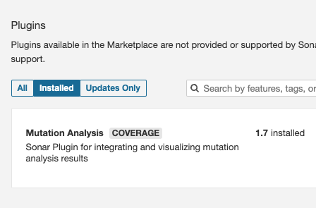
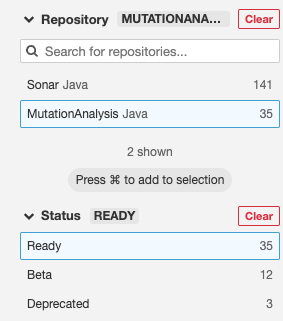
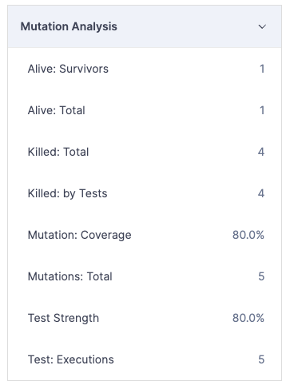
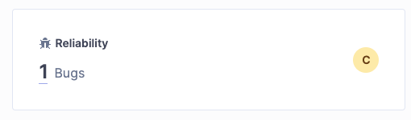
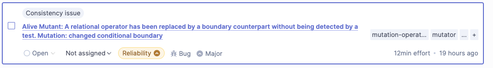

# Tests mutantes en Java


Los tests mutantes se encargan de modificar parte de la lógica del código sobre el que hemos hecho tests unitarios. A estos cambios se les conoce como mutaciones (ej: Tenemos una condición > y el mutante la cambia a <). 
Esto nos sirve para verificar que nuestros tests tienen en cuenta todas las condiciones y posibles comportamientos de nuestro código. El haber cambiado una condición provocará que al volver a lanzar los tests, alguno de ellos fallará. A esto se le conoce como matar la mutación y es el comportamiento que debiera darse. 

Si tenemos una mutación y todos los tests siguen pasando (la mutación sigue viva), quiere decir que no se han creado tests que cubran esa condición o que los existentes están mal programados. 

En el entorno de Java tenemos un plugin llamado Pit que se encarga de automatizar todas estas pruebas. Además, se puede lanzar junto a sonar.

### Requerimientos para lanzar sonar con pit

Existe un plugin para Sonar: https://github.com/devcon5io/mutation-analysis-plugin

#### Instalamos el plugin



#### Activamos las reglas 

Para activar las reglas incluidas con el plugin tenemos que ir a Quality Profiles y seleccionar el perfil al que queremos añadir las reglas. Una vez en el perfil pulsamos en Activate More. En el apartado repository del filtro seleccionamos MutationAnalysis y en el apartado status seleccionamos Ready. Esto nos mostrará las reglas del plugin que sean estables. Activamos todas y ya tenemos sonar preparado.



#### Configuramos nuestro proyecto

Para configurar Pit y poder lanzar desde línea de comandos el informe de sonar con los tests mutantes, tenemos que añadir los siguientes fragmentos de código al fichero pom.xml.

Por defecto pit genera ficheros html, mientras que sonar requiere de xml, esto hace que tengamos que configurar el plugin para que el formato de salida sea xml. Se pueden configurar muchas otras propiedades como para que clases y paquetes generar tests mutantes, que conjunto de mutaciones están activadas, etc.

El sistema de reporting que se va a usar es Jacoco, por lo que su correspondiente plugin también es necesario.

```java
<build>
        <plugins>
            <plugin>
                <groupId>org.springframework.boot</groupId>
                <artifactId>spring-boot-maven-plugin</artifactId>
            </plugin>
            <plugin>
                <groupId>org.jacoco</groupId>
                <artifactId>jacoco-maven-plugin</artifactId>
                <version>0.8.11</version>
            </plugin>
            <plugin>
                <groupId>org.pitest</groupId>
                <artifactId>pitest-maven</artifactId>
                <version>1.15.0</version>
                <configuration>
                    <outputFormats>
                        <outputFormat>xml</outputFormat>
                    </outputFormats>
                </configuration>
            </plugin>
        </plugins>
    </build>
```

Pit necesita la siguiente dependencia para poder trabajar con junit.

```java
    <dependencies>
        <dependency>
            <groupId>org.pitest</groupId>
            <artifactId>pitest-junit5-plugin</artifactId>
            <version>1.2.0</version>
        </dependency>
    </dependencies>
```

#### Lanzamos el comando necesario

Ejemplo de comando para lanzar sonarqube con los tests mutantes

```
mvn clean verify jacoco:report org.pitest:pitest-maven:mutationCoverage -Pcoverage sonar:sonar \
   -Dsonar.token=TU_TOKEN \
   -Dsonar.host.url="PUERTO_SONAR" \
   -Dsonar.dynamicAnalysis="reuseReports" \
   -Dsonar.exclusions="**/*.xml,**/*.yml,**/*.properties,**/*.json,**/*.config,**/*.md" \
   -Dsonar.java.coveragePlugin="jacoco" \
```

#### Resultado del reporte

En el apartado del reporte correspondiente a las mutaciones podemos ver como una mutación ha sobrevivido, lo que indica que hay una parte de los tests que no funciona como debería o que hay algunas condiciones sin cubrir. 

Si vamos al fichero correspondiente podremos ver qué condición es la que no está completamente cubierta por los tests.



Desde el análisis general del sonar también podremos ver las mutaciones que no han muerto a modo de bugs, en reliability: 



Accediendo a estos podremos ver información sobre: clases donde se ha dado la mutación viva, condición que se ha cambiado, línea...




##### Documentación

* [Documentación oficial Pit](https://pitest.org/)
* [Mutaciones que realiza Pit](https://pitest.org/quickstart/mutators/)
* [Configurar Sonarqube + Pit ](https://mydeveloperplanet.com/2020/04/07/mutation-testing-with-sonarqube/)
